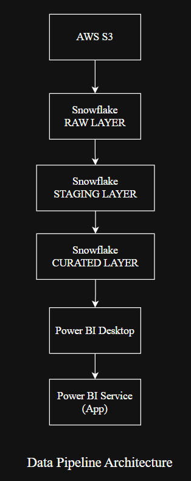
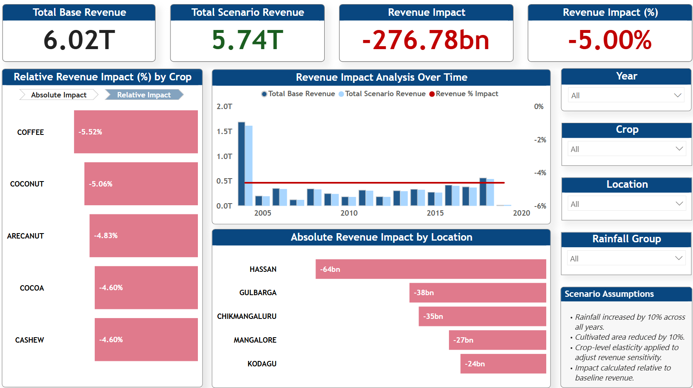

# 🌾 Agriculture Revenue Scenario Impact Analysis

## 📌 Project Overview

This project analyzes the financial impact of simulated agricultural scenario changes on total revenue across crops, locations, and time.

Using a layered Snowflake data architecture and a Power BI analytical dashboard, the solution evaluates how environmental and operational changes affect revenue performance.

The final output is deployed as an interactive **Power BI App**.

---

## 🎯 Business Objective

Agricultural revenue is highly sensitive to environmental variables such as rainfall and cultivated area.

This project was designed to:

- Simulate controlled scenario changes  
- Measure absolute and relative revenue impact  
- Identify the most affected crops and districts  
- Enable interactive exploration through a BI application  

---

## 🏗️ Architecture



### Data Flow

1. **AWS S3** – External raw data storage  
2. **Snowflake – RAW Layer** – Ingested source data  
3. **Snowflake – STAGING Layer** – Data cleansing and transformations  
4. **Snowflake – CURATED Layer** – Business-ready analytical models  
5. **Power BI Desktop** – Data modeling, DAX calculations, dashboard design  
6. **Power BI Service (App)** – Published interactive report  

---

## 📊 Dashboard Preview



---

## 🔍 Key Metrics

- Total Base Revenue  
- Total Scenario Revenue  
- Revenue Impact (Absolute)  
- Revenue Impact (%)  
- Impact by Crop (Absolute & Relative)  
- Impact by Location (Absolute & Relative)  
- Revenue Trend Analysis Over Time  

---

## 🧠 Scenario Assumptions

- Rainfall increased by **10% across all years**  
- Cultivated area reduced by **10%**  
- Crop-level elasticity applied to adjust revenue sensitivity  
- Impact calculated relative to baseline revenue  

---

## 📈 Scenario Analysis & Key Findings

### Scenario Logic

The scenario simulates a controlled environmental and operational shock:

- Rainfall increased by 10%
- Cultivated area reduced by 10%
- Rainfall elasticity applied at 0.6
- Resulting yield increase = 6% (10% × 0.6)

Adjusted yield per area is calculated as:

Adjusted Yield = Base Yield × 1.06

Total scenario production is then computed using the reduced cultivated area, and final scenario revenue is derived accordingly.

---

### Overall Impact

- The scenario resulted in an approximate **5% decline in total revenue**.
- Yield gains from increased rainfall were insufficient to offset the reduction in cultivated area.
- This indicates that land availability has a stronger revenue influence than rainfall-driven productivity improvements under the given assumptions.

---

### Crop-Level Findings

- Coconut experienced the largest absolute revenue decline.
- Coffee showed the highest relative percentage sensitivity.
- High-revenue crops exhibited greater absolute volatility under operational shocks.

---

### Location-Level Findings

- Hassan district recorded the largest absolute revenue loss.
- Impact distribution remained consistent across years due to uniform scenario application.

---

### Strategic Insight

This simulation demonstrates that:

- Revenue sensitivity is highly dependent on cultivated area.
- Environmental improvements alone may not compensate for land contraction.
- Scenario modeling enables proactive revenue risk assessment before operational decisions are implemented.

---

## 🧮 Core DAX Logic

Revenue impact percentage is calculated as:

```DAX
Revenue % Impact =
DIVIDE(
    SUM('AGRICULTURE_ANALYTICS'[SCENARIO_REVENUE])
    - SUM('AGRICULTURE_ANALYTICS'[BASE_REVENUE]),
    SUM('AGRICULTURE_ANALYTICS'[BASE_REVENUE])
)
```

This ensures safe division and dynamic recalculation across filters.

---

## 🛠️ Tech Stack

- **AWS S3** – Cloud storage  
- **Snowflake** – Data warehousing & layered modeling  
- **SQL** – ETL and transformations  
- **Power BI Desktop** – Data modeling & visualization  
- **Power BI Service** – App deployment  
- **DAX** – Analytical calculations  
- **GitHub** – Version control & documentation  

---

## 🚀 Live Power BI App

Access the deployed application here:

🔗 https://app.powerbi.com/Redirect?action=OpenApp&appId=3f084f58-be01-44c2-8bcd-3f35a6ce1bc1&ctid=f419c9fe-f7b0-4d87-bee8-e8dfb2190cab&experience=power-bi

---

## 📁 Repository Structure

```
agriculture-scenario-impact-analysis/
│
├── 01_snowflake_sql/
│   ├── 01_s3_integration_and_raw_ingestion.sql
│   ├── 02_staging_transformations.sql
│   └── 03_curated_business_layer.sql
│
├── 02_powerbi/
│   └── agriculture-scenario-impact-dashboard.pbix
│
├── 03_documentation/
│   ├── architecture-diagram.png
│   ├── dashboard-overview.png
|   └── dax_measures.md
│
└── README.md
```

---

## 📈 Key Insights

- Overall scenario resulted in a **5% revenue decline**
- Coconut and Coffee experienced the highest relative impact
- Hassan district recorded the largest absolute revenue loss
- Impact remained consistent across years due to uniform scenario assumptions

---

## 💡 What This Project Demonstrates

- End-to-end data engineering pipeline design  
- Snowflake layered architecture (RAW → STAGING → CURATED)  
- Scenario modeling implementation  
- Advanced Power BI dashboard development  
- Bookmark-based visual toggling  
- Conditional formatting for impact visualization  
- Production-style BI app deployment  

---

## 👤 Author

**Prajwal Anand**

---
